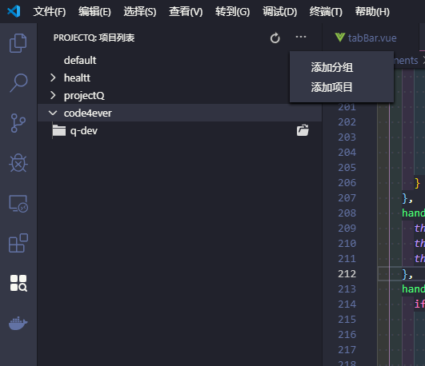
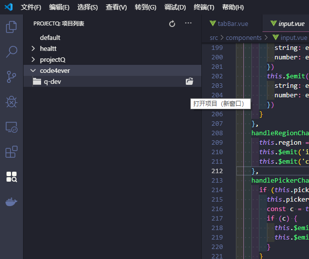
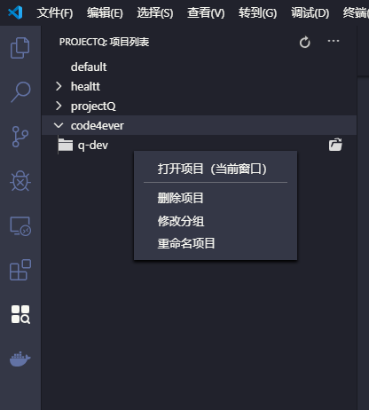

# projectQ

`projectQ` is short for `Project Quick Switch`

a extension for visual studio code, which can manage projects and switch project without windows explorer

## Features

- Manage project in one panel
- Quick open or switch project
- Category for projects

## How to use

- ## Install

Install through VS Code extensions. Search for `projectQ`

- ## add project

Click `add project` button in extend menu at the top of `ProjectQ` panel, then choose category for current project
> each project have a unique id after add, one real project can be add many times

- ## add category

Click `add category` button in extend menu at the top of `ProjectQ` panel, then type name for current category

- ## switch project (open project in current window)

right click or mouse hover the project item in `projectQ` panel, choose `open a project (current window)`

- ## open project (open project in new window)

right click or mouse hover the project item in `projectQ` panel, choose `open a project (new window)`

- ## change project's category

right click the project item in `projectQ` panel, choose `change project's category`

- ## change project's display name

right click the project item in `projectQ` panel, choose `change project's name`

- ## delete project

right click the project item in `projectQ` panel, choose `delete a project`
> delete project in `ProjectQ` won't effect file

- ## change category

right click the category item in `projectQ` panel, choose `change a category's name`

- ## delete category

right click the category item in `projectQ` panel, choose `delete a category`
> the project in current category will move to the `default` category
> the `default` category can't be removed, but you can edit the display name
